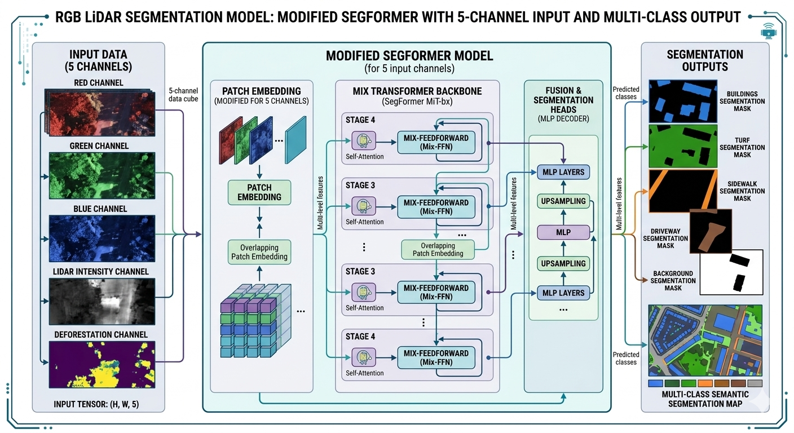

# AI4LAWNv5

**AI4LAWNv5** is an advanced AI-powered computer vision service for high-resolution aerial imagery analysis, with a strong focus on **lawn & turf segmentation**, property feature extraction, and vegetation assessment.

It performs semantic segmentation to identify:
- Buildings
- Turf / Lawn
- Trees
- Sidewalks
- Driveways

Additionally, it provides **tree canopy coverage estimation** and now integrates **LiDAR-derived auxiliary channels** to improve robustness under varying lighting, shadows, and vegetation conditions.

The system exposes a **RESTful API** suitable for integration with web applications, GIS platforms, property tech, insurance, landscaping, and municipal planning tools.

---

## ✨ What's New in V5

   
   
- **Two new LiDAR-derived input channels** (4th & 5th channels) added to the model input stack:
  1. **Normalized LiDAR Intensity** — captures surface reflectance properties (bright = high-reflectance surfaces like concrete/roads; dark = vegetation/asphalt/water)
  2. **LiDAR-derived "Deforestation Proxy"** — uses last-return intensity values as a proxy for ground-level openness (higher values indicate more open, lawn-like surfaces; lower values indicate dense canopy or structures)
- **Optional `metadata` dictionary** in API requests — allows passing geospatial context (lat/lon, bounds, capture date, etc.) for future provenance, reprojection, or multi-temporal analysis.
- Improved tiling logic for very large images (configurable `num_slices` and overlap).
- Enhanced normalization consistency between training and inference pipelines.
- Updated knowledge-distilled **Lawn Student Model** now accepts 5-channel input (RGB + Intensity + Deforestation Proxy).
- **Sample Prediction** using the new **Lawn Student Model** and **Tree Model**.
- 
- 
- 
---
### Scientific Background — New LiDAR Channels

Modern semantic segmentation models for aerial imagery benefit significantly from **multispectral** and **geometric** auxiliary inputs. In V5 we introduce two LiDAR-derived features:

1. **Channel 4: Normalized LiDAR Intensity**  
   Airborne LiDAR systems record the **intensity** of the backscattered laser pulse (typically 0–65535 scale in LAS format).  
   Intensity is primarily influenced by:
   - Surface reflectance (albedo)
   - Incidence angle
   - Range to target
   - Material properties (vegetation typically lower, impervious surfaces higher)

   After rasterization (max value per pixel) + 3×3 morphological dilation + per-tile normalization, this channel helps the model distinguish:
   - Impervious surfaces (driveways, sidewalks, roofs)
   - Vegetated vs. non-vegetated areas under shadow or uniform lighting

2. **Channel 5: LiDAR Last-Return Intensity Proxy (Deforestation/Openness)**  
   Last-return points (single or last in multi-return pulses) are most likely to represent the ground or low vegetation.  
   By rasterizing the **intensity** (not elevation) of these points, we create a proxy for **surface openness**:
   - High intensity → open, reflective ground (lawns, bare soil, pavement)
   - Low intensity → dense canopy, buildings, or absorbing surfaces

   This channel complements optical RGB by providing **height-informed texture** without requiring full DTM/DSM differencing, making it lightweight yet powerful for turf vs. tree discrimination.

Both channels are sourced from USGS 3DEP EPT datasets (when available) or raw LAZ files, processed consistently between training and inference.

---

## 🔧 Installation

1. Clone the repository

```bash
git clone https://github.com/AI4LAWNv5.git
cd AI4LawnV5
```

2. Install dependencies

```bash
pip install -r requirements.txt
```

3. Download pre-trained models and place them in `./models/`

- **Lawn Student Model** (Buildings, Sidewalk, Lawn, Driveway + LiDAR channels)  
  [Download Link](https://drive.google.com/file/d/1f6VxBEbbYLCXBjqIiEp0GoXKt7rEtOTb/view?usp=sharing) → rename to `lawn_model.pth`

- **Tree Segmentation & Coverage Model**  
  [Download Link](https://drive.google.com/...) → rename to `tree_model.pth`

> **Important:** Models must be placed in `./models/` before starting the API.

---

## 🚀 Running the API

```bash
python app.py
```

The Flask development server will start (default: http://127.0.0.1:5000).

---

## 📡 API Endpoint

### GET /model/predict-boundary

Performs segmentation and returns masks + tree coverage statistics.

**Method:** GET  
**Content-Type:** application/json

#### Query Parameters

| Parameter       | Type    | Required | Description                                                                 |
|-----------------|---------|----------|-----------------------------------------------------------------------------|
| `mapurl`        | string  | Yes      | Public URL to the aerial RGB image                                          |
| `boundaryPoints`| list    | Yes      | Polygon coordinates in pixel space [[x1,y1], [x2,y2], ...]                 |
| `features`      | list    | Yes      | Features to return: ["TREE", "BUILDING", "SIDEWALK", "LAWN", "DRIVEWAY"]   |
| `tiling_flag`   | boolean | No       | Enable automatic tiling for large images (default: true)                   |
| `num_slices`    | int     | No       | Number of tiles per side when tiling (default: 3 → 3×3 = 9 tiles)          |
| `metadata`      | dict    | **No**   | Optional geospatial metadata. To fetch LCP GeoRefrenced Data to Enable Lidar based model Predictions  (see example below)    
|

#### Example with metadata

```http
GET /model/predict-boundary?\
mapurl=https://example.com/image.jpg&\
boundaryPoints=[[[100,100],[200,100],[200,200],[100,200],[100,100]]]&\
features=["TREE","LAWN","BUILDING"]&\
metadata={"center_lat":43.117851,"center_lng":-88.525741,"bound_north":43.11852777,"bound_south":43.11702412,"bound_east":-88.5243988,"bound_west":-88.52645874,"zoom":19,"capture_date":"2025-12-24"}
```

- 

---

## 🧠 Models

- `lawn_student_v5_5ch.pth`  
  5-channel (RGB + Intensity + Deforestation Proxy) student model distilled from teacher ensemble for multi-class segmentation.

- `tree_model.pth`  
  Dedicated binary tree segmentation + canopy fraction estimation.

---

## 📁 Project Structure

```
AI4LawnV5/
├── app.py                    # Flask API server
├── predict_boundary/         # Output directory for predictions
├── models/                   # Pre-trained .pth files go here
├── utils/
│   ├── lidar_fetch.py        # USGS EPT / LAZ downloader & processor
│   ├── tiling.py             # Large image tiling utilities
│   └── model.py              # Model Architecture
└── README.md
```

---

## 📌 Important Notes

- Python 3.10+ recommended
- LiDAR channels are **optional fallback** — if unavailable, model runs on RGB only (but performance may degrade in shadowed/vegetated areas)
- USGS 3DEP EPT coverage is excellent across most of the United States; outside USA availability is limited
- Use `tiling_flag=true` + higher `num_slices` for images > 2000×2000 px

---

## 📷 Model Outputs

| Building                     | Sidewalk                     | Lawn                        | Driveway                    | Tree                       |
|------------------------------|------------------------------|-----------------------------|-----------------------------|----------------------------|
|  |  |        |  |      |


---

## 🤝 Credits & License

Developed by **DeepLawn** 
Licensed under **MIT License** (see LICENSE file)

Pre-trained models hosted via Google Drive (links above).

Questions, contributions, or issues? → Open an issue or contact via GitHub.
```
